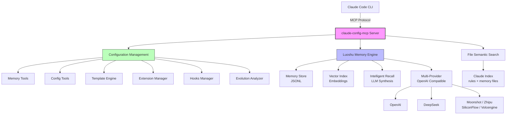

# claude-config-mcp

[English](README.md) | [中文](README.zh-CN.md)

[](https://github.com/znlnzi/claude-config-studio/actions/workflows/ci.yml)
[](https://codecov.io/gh/znlnzi/claude-config-studio)
[](https://www.npmjs.com/package/claude-config-mcp)
[](https://opensource.org/licenses/MIT)

**Claude Code forgets everything between sessions. This MCP server fixes that.**

📖 **[Documentation](https://znlnzi.github.io/claude-config-studio/)** | 📦 **[npm](https://www.npmjs.com/package/claude-config-mcp)** | 🗺️ **[Roadmap](ROADMAP.md)**

claude-config-mcp manages your Claude Code `.claude/` configuration through MCP tools, and adds **luoshu (洛书)** — a cross-session intelligent memory system that lets Claude remember your decisions, preferences, and project context across conversations.

## Architecture



## Features

### Configuration Management

Manage Claude Code's `.claude/` directory through MCP tools:

- **Memory** — Read/write/search `.claude/memory/` files across projects
- **Config** — Get/save global and project-level configuration (CLAUDE.md, settings.json, .mcp.json)
- **Templates** — Install/uninstall configuration template packs (rules, agents, skills, commands)
- **Extensions** — CRUD operations for agents, rules, skills, and commands
- **Hooks** — Manage event hooks (PreToolUse, PostToolUse, SessionStart, Stop, etc.)
- **Evolution** — Analyze rules for duplicates, gaps, and health issues

### Luoshu (洛书) Intelligent Memory

Cross-session memory system powered by LLM and vector search:

- **Auto-extraction** — Automatically extract key decisions, patterns, and context from conversations
- **Semantic search** — Find related memories using vector similarity, not just keywords
- **Intelligent recall** — Ask natural language questions like "what decisions were made about auth?" and get synthesized answers
- **Graceful degradation** — Works without LLM config (keyword search only), unlocks full power with LLM

## Installation

### npm (recommended)

```bash
npm install -g claude-config-mcp
```

This installs the binary for your platform and registers `/luoshu.setup` and `/luoshu.config` skills.

Then register the MCP server:

```bash
claude mcp add claude-config -s user -- npx -y claude-config-mcp
```

### From source

```bash
git clone https://github.com/znlnzi/claude-config-studio.git
cd claude-config-studio
make install
```

This builds the binary, installs it to `~/.local/bin/`, copies skills to `~/.claude/skills/`, and registers with Claude Code.

## Quick Start

After installation, restart Claude Code and type:

```
/luoshu.setup
```

This will:
1. Detect your project type and tech stack
2. Ask 3 quick questions about your preferences
3. Install matching configuration templates
4. Guide you through LLM setup for intelligent memory (optional)

## MCP Tools

### Memory Management

| Tool | Description |
|------|-------------|
| `save_memory` | Save a memory entry to `.claude/memory/` |
| `load_memory` | Load memory files from a project |
| `search_memory` | Keyword search with automatic semantic supplement |

### Configuration

| Tool | Description |
|------|-------------|
| `config_get_global` | Get global Claude Code configuration |
| `config_save_global` | Save global configuration field |
| `config_save_project` | Save project-level configuration field |
| `get_project_config` | Get project's `.claude/` directory overview |
| `list_projects` | List all managed projects |

### Templates

| Tool | Description |
|------|-------------|
| `template_list` | List available configuration templates |
| `template_install` | Install a template to project or global scope |
| `template_uninstall` | Uninstall a template |
| `template_installed` | List installed templates |

### Extensions

| Tool | Description |
|------|-------------|
| `extension_list` | List extensions (agents/rules/skills/commands) |
| `extension_read` | Read an extension file |
| `extension_save` | Create or update an extension |
| `extension_delete` | Delete an extension |

### Hooks

| Tool | Description |
|------|-------------|
| `hooks_list` | List configured hooks |
| `hooks_save` | Save hooks configuration |

### Evolution

| Tool | Description |
|------|-------------|
| `evolve_status` | Get evolution system status |
| `evolve_analyze` | Analyze rules for issues |
| `evolve_apply` | Approve or reject a suggestion |

### Luoshu Config

| Tool | Description |
|------|-------------|
| `luoshu_config_get` | Get current luoshu configuration (API keys masked) |
| `luoshu_config_set` | Set a configuration field with key pre-validation |
| `luoshu_config_validate` | Test LLM/Embedding connection |
| `luoshu_provider_list` | List all available LLM provider presets |

### Luoshu Memory

| Tool | Description |
|------|-------------|
| `memory_extract` | Extract key points from conversation text |
| `memory_semantic_search` | Vector similarity search over memories |
| `luoshu_recall` | Intelligent recall with LLM synthesis |

### Luoshu Status

| Tool | Description |
|------|-------------|
| `luoshu_status` | Get system stats (memory count, index size, cache) |
| `luoshu_reindex` | Rebuild vector index |

### Import/Export

| Tool | Description |
|------|-------------|
| `export_config` | Export configuration as base64-encoded ZIP |
| `import_config` | Import configuration from base64-encoded ZIP |

### MCP Resources

Read-only access to configuration files via MCP resource URIs:

| URI | Description |
|-----|-------------|
| `claude://global/claude-md` | Global CLAUDE.md instructions |
| `claude://global/memory/{filename}` | Global memory files |
| `claude://project/{path}/memory/{filename}` | Project memory files |

## Luoshu Configuration

Luoshu uses a local config file at `~/.luoshu/config.json`. Configure via `/luoshu.config` or environment variables:

| Environment Variable | Description |
|---------------------|-------------|
| `LUOSHU_LLM_API_KEY` | LLM service API key |
| `LUOSHU_LLM_MODEL` | LLM model name |
| `LUOSHU_EMBEDDING_API_KEY` | Embedding service API key |
| `LUOSHU_EMBEDDING_MODEL` | Embedding model name |

Supported LLM providers (OpenAI-compatible API):

| Provider | Preset Name |
|----------|------------|
| OpenAI | `openai` |
| DeepSeek | `deepseek` |
| Moonshot (Kimi) | `moonshot` |
| Zhipu (GLM) | `zhipu` |
| SiliconFlow | `siliconflow` |
| Volcengine Doubao | `volcengine` |
| Custom | `custom` |

Use `luoshu_provider_list` to see all presets, or set `llm.provider` to any preset name — endpoint and model defaults are auto-filled.

## Transport Modes

```bash
# stdio (default, for Claude Code integration)
claude-config-mcp

# HTTP (for Docker, shared deployments)
claude-config-mcp --transport http --http-addr localhost:8080
```

HTTP mode exposes a Streamable HTTP endpoint at `/mcp`.

## Supported Platforms

| Platform | Architecture |
|----------|-------------|
| macOS | ARM64 (Apple Silicon) |
| macOS | x64 (Intel) |
| Linux | x64 |
| Linux | ARM64 |
| Windows | x64 |

## Project Structure

```
claude-config-studio/
├── cmd/mcp-server/       # MCP Server entry point (Go)
├── internal/
│   ├── luoshu/           # Luoshu memory engine (vector index, recall, config)
│   ├── templatedata/     # Built-in template definitions
│   └── evolution/        # Rules evolution engine
├── npm/                  # npm package distribution
├── dist/skills/          # Global skills (/luoshu.setup, /luoshu.config)
├── python/openviking-mcp/  # OpenViking semantic search MCP server (Python)
├── scripts/              # Build and publish scripts
└── Makefile              # Build, test, install targets
```

The main component is the **Go MCP Server** (`cmd/mcp-server/`), distributed via npm with pre-built binaries for all platforms.

`python/openviking-mcp/` is a companion Python MCP server providing semantic search over Claude Code memory and rules files via [OpenViking](https://pypi.org/project/openviking/).

## Development

```bash
# Build MCP server only
make mcp

# Run lint + build + tests
make test

# Run tests with verbose output
go test ./internal/... -v

# Cross-compile for all platforms
make npm-build

# Clean build artifacts
make clean
```

## Contributing

See [CONTRIBUTING.md](CONTRIBUTING.md) for development setup, code style, and pull request guidelines.

## License

MIT
