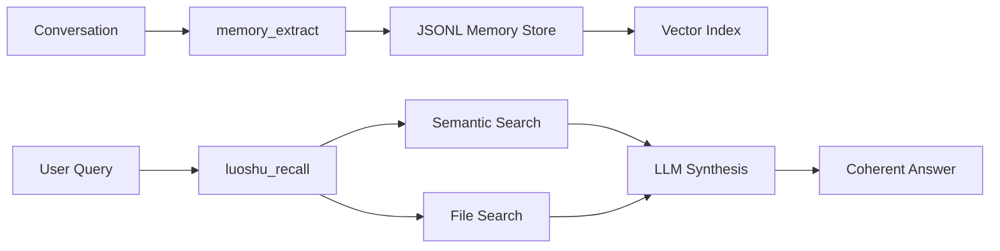

# Luoshu Intelligent Memory

Luoshu (洛书) is a cross-session intelligent memory system that lets Claude remember decisions, preferences, and project context across conversations.

## How It Works



1. **Extract** — Key decisions and patterns are extracted from conversations and stored as JSONL entries
2. **Index** — Each memory entry is embedded as a vector for similarity search
3. **Recall** — Natural language queries search across both JSONL memories and `.claude/` files, with LLM synthesis producing coherent answers

## Configuration

Luoshu uses a local config file at `~/.luoshu/config.json`. Configure via the `/luoshu.config` skill or environment variables.

### Using the Config Skill

```
/luoshu.config
```

This interactive skill guides you through setting up LLM and embedding providers.

### Environment Variables

| Variable | Description |
|----------|-------------|
| `LUOSHU_LLM_API_KEY` | LLM service API key |
| `LUOSHU_LLM_MODEL` | LLM model name |
| `LUOSHU_EMBEDDING_API_KEY` | Embedding service API key |
| `LUOSHU_EMBEDDING_MODEL` | Embedding model name |

### Configuration Tools

| Tool | Description |
|------|-------------|
| `luoshu_config_get` | View current config (API keys are masked) |
| `luoshu_config_set` | Set a config field with validation |
| `luoshu_config_validate` | Test LLM/Embedding connection |

### Provider Setup

Set a provider preset to auto-fill endpoint and model defaults:

```
Tool: luoshu_config_set
Parameters:
  key: "llm.provider"
  value: "deepseek"
```

Then set your API key:

```
Tool: luoshu_config_set
Parameters:
  key: "llm.api_key"
  value: "sk-your-api-key"
```

See [Providers Reference](/reference/providers) for all available presets.

## Graceful Degradation

Luoshu works at three capability levels:

| Level | Requirements | Available Features |
|-------|-------------|-------------------|
| Basic | None | Keyword search over memory files |
| Semantic | Embedding configured | Vector similarity search |
| Full | LLM + Embedding configured | Intelligent recall with LLM synthesis, auto-extraction |

You can start with keyword search and upgrade to full capabilities later.

## Memory Tools

### Extract Memories

`memory_extract` takes a session summary and extracts key decisions, patterns, and context as structured memory entries.

```
Tool: memory_extract
Parameters:
  session_summary: "We decided to use PostgreSQL for the database..."
  project_path: "/path/to/project"
  tags: "database,architecture"
```

::: tip
Use `memory_extract` in `PreCompact` hooks to automatically save context before compression.
:::

### Semantic Search

`memory_semantic_search` finds memories using vector similarity, not just keyword matching.

```
Tool: memory_semantic_search
Parameters:
  query: "what database did we choose"
  mode: "auto"
```

Modes:
- `auto` — hybrid search (keyword + semantic), recommended
- `semantic` — vector similarity only
- `keyword` — keyword matching only

### Intelligent Recall

`luoshu_recall` combines semantic search with LLM synthesis. It searches both JSONL memory entries and `.claude/` file contents, then produces a coherent answer.

```
Tool: luoshu_recall
Parameters:
  query: "summarize all decisions about authentication"
```

## File Semantic Search (OpenViking)

In addition to JSONL memory search, Luoshu integrates OpenViking for semantic search over `.claude/memory/*.md`, `.claude/rules/*.md`, and the project root `MEMORY.md`.

| Tool | Description |
|------|-------------|
| `ov_search` | Semantic search over Claude Code files |
| `ov_index` | Manually rebuild the file index |
| `ov_status` | Check index status |

`ov_search` auto-indexes on first use — no manual setup required.

## Status and Maintenance

### Check System Status

```
Tool: luoshu_status
# Returns: version, config status, memory count, index size, cache size
```

### Rebuild Vector Index

If search results seem stale or inconsistent:

```
Tool: luoshu_reindex
# Rebuilds the entire vector index from all memory entries
```
