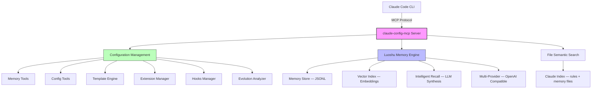

## Architecture

```mermaid
graph TB
    CC[Claude Code CLI] -->|MCP Protocol| MCP[claude-config-mcp Server]

    MCP --> CM[Configuration Management]
    MCP --> LU[Luoshu Memory Engine]
    MCP --> OV[File Semantic Search]

    CM --> Memory[Memory Tools]
    CM --> Config[Config Tools]
    CM --> Templates[Template Engine]
    CM --> Extensions[Extension Manager]
    CM --> Hooks[Hooks Manager]
    CM --> Evolution[Evolution Analyzer]

    LU --> Store[Memory Store — JSONL]
    LU --> VecIdx[Vector Index — Embeddings]
    LU --> Recall[Intelligent Recall — LLM Synthesis]
    LU --> Provider[Multi-Provider — OpenAI Compatible]

    OV --> ClaudeIdx[Claude Index — rules + memory files]

    style MCP fill:#f9f,stroke:#333,stroke-width:2px
    style LU fill:#bbf,stroke:#333
    style CM fill:#bfb,stroke:#333
```
